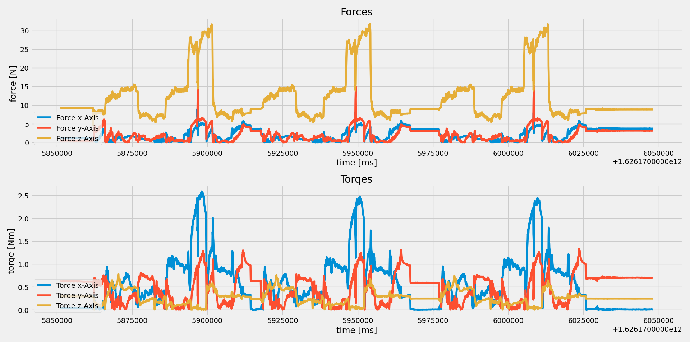

## <u>Kräfte/Drehmoment- Messung</u>

- <i> Service_Force_Messurement.py </i> should be running as a service. This service is requesting data via MQTT and logs in into a <i>forces.cvs</i> file.
- <i> plotForces.py </i> is plotting the data as a live graph in 40msec intervalls.

Example:
