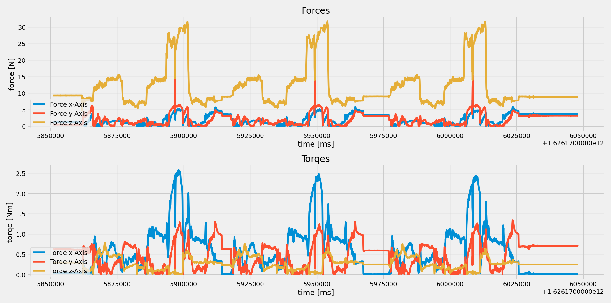
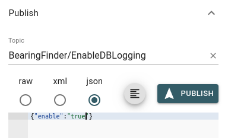

# <u>Force/Torque- measurement</u>

- <i> Service_Force_Messurement.py </i> should be running as a service. This service is requesting data via MQTT and logs in into a <i>forces.cvs</i> file.
- <i> plotForces.py </i> is plotting the data as a live graph in 40msec intervalls.

Example:

## How To:  
First run the service which is logging the data like this
- python3 Service_Force_Messurement.py

Afterwards run

- python3 plotForces.py

Now you should see an empty plot, for getting data you need to enable logging via publishing following to the topic <i>BearingFinder/EnableDBLogging</i>

- {"enable" : "true"}

This can be done by any MQTT Client or an MQTT tool like <i>MQTT Explorer</i> 

## Stopping plotting

This can be done by publishing a message to the same topic where enabling it <i>BearingFinder/EnableDBLogging</i>

- {"enable" : "false"}

If you want want to make a complete new plot delete the forces.cvs file
Hit <i>Crtl + C</i> for stopping the <i>Service_Force_Messurement.py</i> and <i>plotForces.py</i> and start them again.